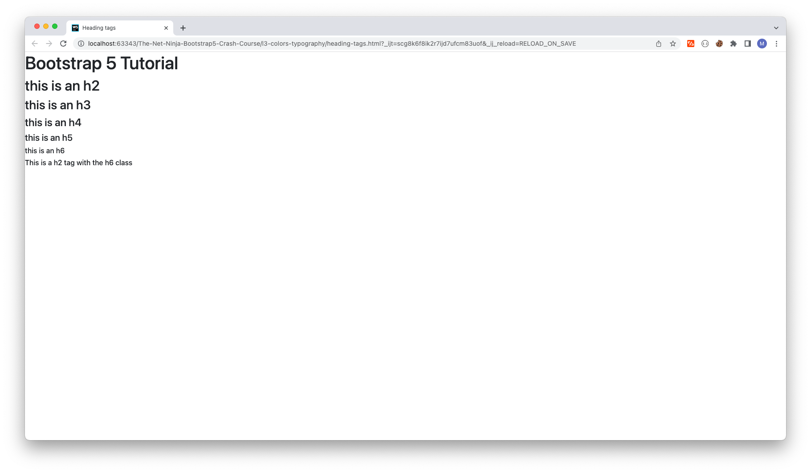
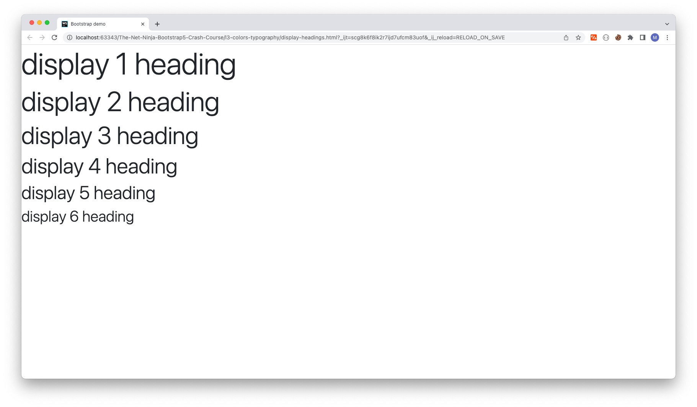
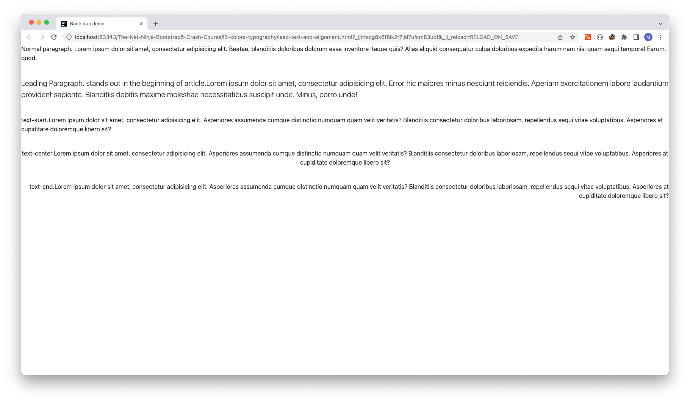
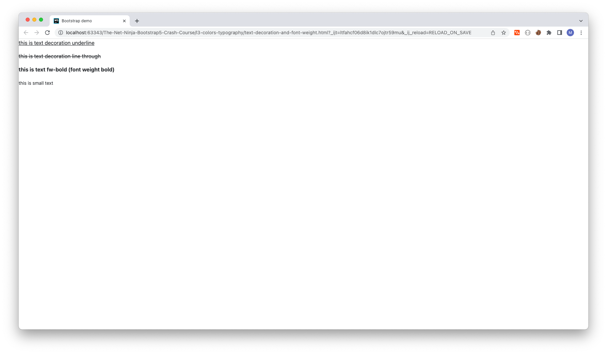
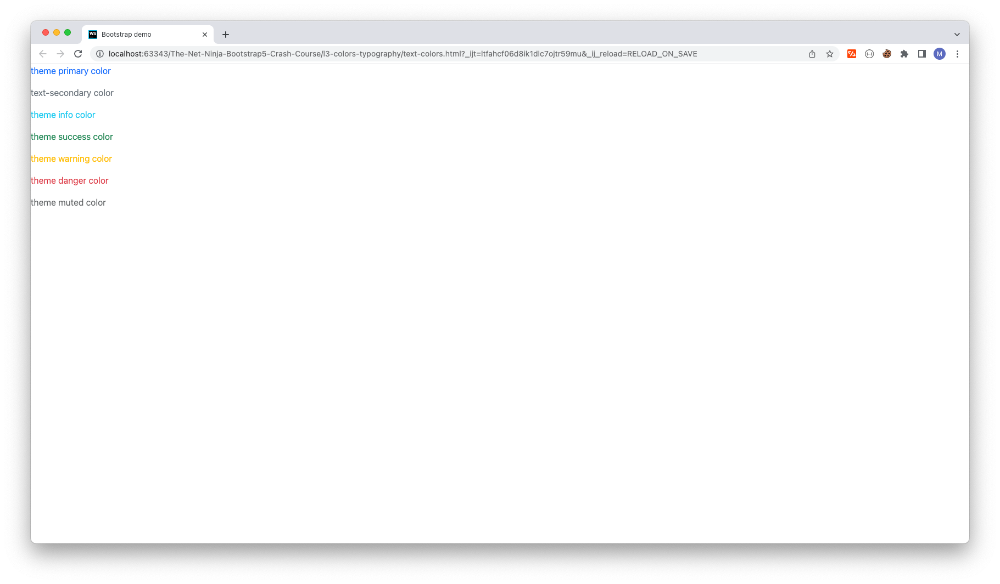
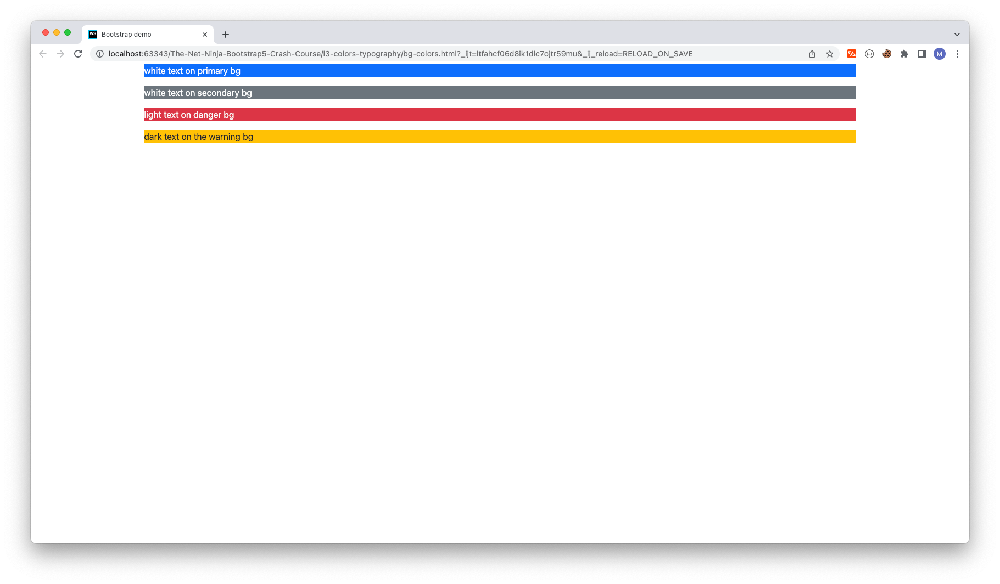

# Tutorial #3 - Colours & Typography


## Heading tags

```html
<!--Heading tags-->
<h1>Bootstrap 5 Tutorial</h1>
<h2>this is an h2</h2>
<h3>this is an h3</h3>
<h2 class="h6"> This is a h2 tag with the h6 class</h2>
```

Traditional heading elements are designed to work best in the meat of your page content. When you need a **heading to stand out**, consider using a display heading—a larger, slightly more opinionated heading style.



## Display headings
```html
<!--Display headings-->
<h1 class="display-1">display 1 heading</h1>
<h1 class="display-2">display 2 heading</h1>
<h1 class="display-3">display 3 heading</h1>
<h1 class="display-4">display 4 heading</h1>
<h1 class="display-5">display 5 heading</h1>
<h1 class="display-6">display 6 heading</h1>
```


## Lead text and alignment 
```html
<!-- Lead text and alignment -->
<p> Normal paragraph. Lorem ipsum dolor sit amet, consectetur adipisicing elit. Beatae, blanditiis doloribus dolorum esse inventore itaque
    quis? Alias aliquid consequatur culpa doloribus expedita harum nam nisi quam sequi tempore! Earum, quod.</p>

<p class="lead"> Leading Paragraph. stands out in the beginning of article.Lorem ipsum dolor sit amet, consectetur adipisicing elit. Error hic maiores minus nesciunt reiciendis.
    Aperiam exercitationem labore laudantium provident sapiente. Blanditiis debitis maxime molestiae necessitatibus
    suscipit unde. Minus, porro unde!</p>

<p class="text-start">text-start.Lorem ipsum dolor sit amet, consectetur adipisicing elit. Asperiores assumenda cumque distinctio
    numquam quam velit veritatis? Blanditiis consectetur doloribus laboriosam, repellendus sequi vitae voluptatibus.
    Asperiores at cupiditate doloremque libero sit?</p>
<p class="text-center">text-center.Lorem ipsum dolor sit amet, consectetur adipisicing elit. Asperiores assumenda cumque distinctio
    numquam quam velit veritatis? Blanditiis consectetur doloribus laboriosam, repellendus sequi vitae voluptatibus.
    Asperiores at cupiditate doloremque libero sit?</p>
<p class="text-end">text-end.Lorem ipsum dolor sit amet, consectetur adipisicing elit. Asperiores assumenda cumque distinctio
    numquam quam velit veritatis? Blanditiis consectetur doloribus laboriosam, repellendus sequi vitae voluptatibus.
    Asperiores at cupiditate doloremque libero sit?</p>
```


## Text decoration and font weight 
```html
<!-- Text decoration & font weight -->
<p class="text-decoration-underline">this is text decoration underline</p>
<p class="text-decoration-line-through">this is text decoration line through</p>
<p class="fw-bold">this is text fw-bold (font weight bold)</p>
<small>this is small text</small>
```



## Text Colors 
```html
<!-- Text colors -->
<p class="text-primary">theme primary color</p>
<p class="text-secondary">text-secondary color</p>
<p class="text-info">theme info color</p>
<p class="text-success">theme success color</p>
<p class="text-warning">theme warning color</p>
<p class="text-danger">theme danger color</p>
<p class="text-muted">theme muted color</p>
```


## Background Colors
```html
<!-- Background Colors-->
<p class="text-white bg-primary">white text on primary bg</p>
<p class="text-white bg-secondary">white text on secondary bg</p>
<p class="text-light bg-danger">light text on danger bg</p>
<p class="text-dark bg-warning">dark text on the warning bg</p>
```
